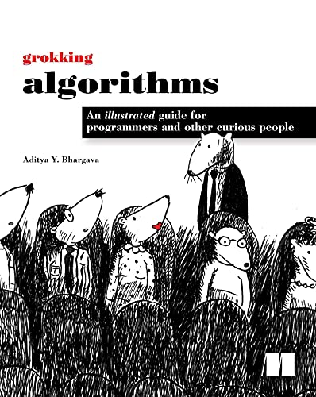

# Python Algorithms

In this repository I will explore and implement many software algorithms in python. There are two reasons for me to try
this out, the first is because I have joined a python project and have no experience programing with the language, and
the second reason is that I want to learn new algorithms and practice others.

The algorithms in this repository are all taken from the
book [Grokking Algorithms](https://www.amazon.com/Grokking-Algorithms-illustrated-programmers-curious/dp/1617292230)

